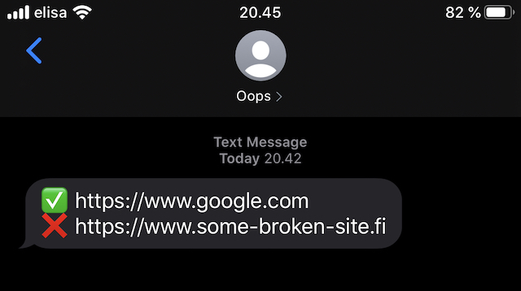

# serverless-healthcheck

Simple health checker lambda with ClojureScript, shadow-cljs and Serverless Framework. Can alert via email or SMS using AWS Simple Notification Service.



## Prerequisites

* [node](https://nodejs.org/en/download/)

On a Mac you can install node easily with [Homebrew](https://brew.sh/).

``` shell
$ brew install node
```

## Install dependencies

```shell
$ npm install
```

## Deploy

```shell
$ npm run deploy
```

## Configuration

See `serverless.yml` for configuration options.

## SES email setup

You need to [verify](https://docs.aws.amazon.com/ses/latest/DeveloperGuide/verify-email-addresses-procedure.html) sender and recipient email addresses in order to send email through SES. If you want to send emails to non-verified recipients you need to [move out of the sandbox](https://docs.aws.amazon.com/ses/latest/DeveloperGuide/request-production-access.html).

SES setup is not required if `sms` delivery method is used instead of `email`.

## Set invoke schedule

See [AWS Lambda docs on cron and rate syntax](https://docs.aws.amazon.com/lambda/latest/dg/tutorial-scheduled-events-schedule-expressions.html) and edit trigger in `serverless.yml` accordingly.
