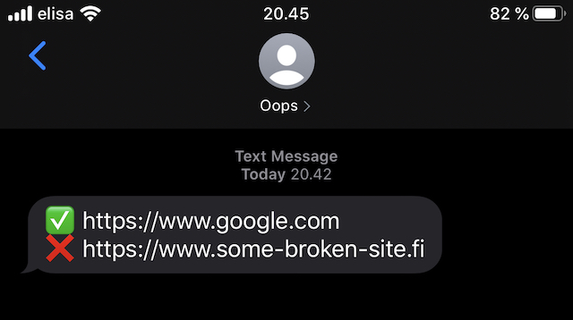

# serverless-healthcheck

Simple health checker Lambda with ClojureScript, shadow-cljs and AWS SAM. Can alert via email or SMS using AWS SNS/SES.



## Prerequisites

* [Node.js](https://nodejs.org/en/download/)
* [AWS SAM CLI](https://docs.aws.amazon.com/serverless-application-model/latest/developerguide/install-sam-cli.html)

On a Mac you can install these with [Homebrew](https://brew.sh/):

```shell
brew install node aws-sam-cli
```

## Install dependencies

```shell
npm install
```

## Configuration

Create a `.env.sh` file with your configuration:

```shell
export AWS_REGION=eu-west-1
export HEALTHCHECK_URLS=https://example.com,https://api.example.com
export DELIVERY_METHOD=email  # or sms
export EMAIL_RECIPIENT=alerts@example.com
export EMAIL_SENDER=sender@example.com
export SMS_PHONE_NUMBER=+1234567890
export SMS_SENDER_ID=MyAlert
```

## Deploy

```shell
npm run deploy
```

This will build the ClojureScript, package with production dependencies only, and deploy to AWS.

## SES email setup

You need to [verify](https://docs.aws.amazon.com/ses/latest/DeveloperGuide/verify-email-addresses-procedure.html) sender and recipient email addresses in order to send email through SES. If you want to send emails to non-verified recipients you need to [move out of the sandbox](https://docs.aws.amazon.com/ses/latest/DeveloperGuide/request-production-access.html).

SES setup is not required if `sms` delivery method is used instead of `email`.

## Set invoke schedule

See [AWS Lambda docs on cron and rate syntax](https://docs.aws.amazon.com/lambda/latest/dg/tutorial-scheduled-events-schedule-expressions.html) and edit the schedule in `template.yaml` accordingly. Default is every 15 minutes.
